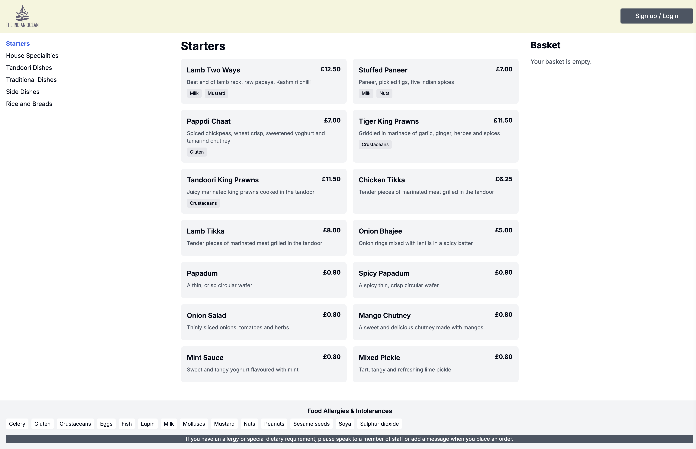

# The Indian Ocean Restaurant - Online Ordering System


## Project Overview

This project is a modern reimagining of The Indian Ocean Restaurant's online ordering system. Built with cutting-edge web technologies, it aims to provide a seamless and intuitive user experience for customers looking to order delicious Indian cuisine online.

Design of the website is mocked up with Figma.


## Features

- **Intuitive Menu Navigation**: Easily browse through various food categories.
- **Dynamic Menu Items**: View detailed descriptions, prices, and allergen information for each dish.
- **Interactive Basket**: Add and remove items with real-time total calculation.
- **Responsive Design**: Optimized for both desktop and mobile viewing.

## Technology Stack

- **Next.js**: For server-side rendering and optimal performance.
- **Tailwind CSS**: For rapid, custom styling with utility-first approach.
- **TypeScript**: For enhanced code quality and developer experience.

## Project Status

This project is currently a front-end prototype. Key points:

- All data is mock data stored in a `data.ts` file.
- The project demonstrates the potential for a full-stack implementation.
- Future plans include adding a landing page and integrating a payment service.


## Getting Started

1. Clone the repository:


```bash
git clone https://github.com/dinulhaque89/indian-ocean-restaurant.git
```


2. Install dependencies:
 ```bash
   cd indian-ocean-restaurant 
   npm install
```

3. Run the development server:
```bash
npm run dev
```

4. Open [http://localhost:3000](http://localhost:3000) in your browser to view the application.

## Project Structure

The project follows a clean and organized file structure:

```
iocean-v1/
│
├── .next/                 # Next.js build output
├── app/                   # Next.js 14+ App Router
│   ├── menu/
│   │   └── [category]/    # Dynamic route for menu categories
│   │       └── page.tsx   # Menu category page component
│   ├── favicon.ico
│   ├── globals.css        # Global styles
│   ├── layout.tsx         # Root layout component
│   └── page.tsx           # Home page component
│
├── components/            # Reusable React components
│   ├── Basket.tsx
│   ├── Footer.tsx
│   ├── Header.tsx
│   ├── MenuItem.tsx
│   ├── MenuItems.tsx
│   └── MenuNavigation.tsx
│
├── data/
│   └── menuData.ts        # Mock data for menu items
│
├── lib/
│   └── utils.ts           # Utility functions
│
├── public/                # Static assets
│
├── types/                 # TypeScript type definitions
│
├── .eslintrc.json         # ESLint configuration
├── .gitignore
├── components.json
├── next-env.d.ts
├── next.config.mjs
├── package-lock.json
├── package.json
├── postcss.config.mjs
├── README.md
├── tailwind.config.ts     # Tailwind CSS configuration
└── tsconfig.json          # TypeScript configuration
```

This structure follows Next.js 14+ conventions with the App Router, separating concerns into distinct directories for components, data, and types. The `app` directory contains the main application logic and routing, while reusable components are stored in the `components` directory.

## Future Enhancements

- Implementation of a dynamic landing page.
- Integration with a backend API for real-time menu updates.
- Addition of user authentication and order history.
- Integration of a secure payment gateway.


Current screenshot of the website.



## Contributing

While this is currently a personal project, suggestions and feedback are welcome. Please open an issue to discuss any changes you'd like to propose.

## License

This project is private and not open for public use or distribution.

## Acknowledgements

- Design inspiration: [[Shirajul Hoque](https://www.linkedin.com/in/shirajul-hoque-47472414a/)]
- Icons: [Heroicons]

## Contact

For any inquiries or potential collaboration, please contact:

Dinul Haque
Email: dinul-haque@live.co.uk
LinkedIn: [https://www.linkedin.com/in/dinul-haque-devops/]

---
Designed by Shirajul Haque and
Developed with ❤️ by Dinul Haque